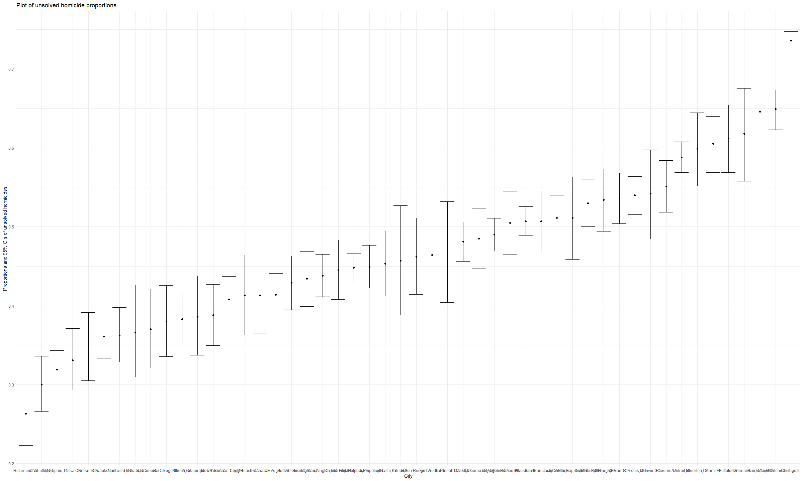
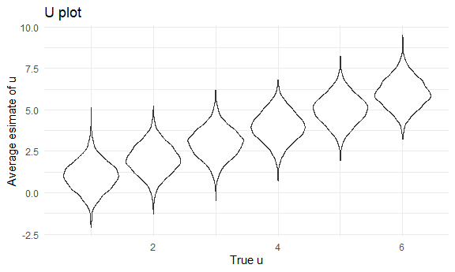

p8105_hw5_ll3407
================
2022-11-10

\##Problem 1

``` r
dataframe = file_name %>% 
  map_df(~read_csv(file.path("./data", .))) %>% 
  bind_cols(file_name) %>% 
  bind_cols(file_name_2) %>% 
  rename(arm = c..con....con....con....con....con....con....con....con....con...) %>% 
  rename(subject_id = c..01....02....03....04....05....06....07....08....09....10...) %>% 
  rename(file =x) %>% 
  pivot_longer(week_1:week_8,
               names_to = "week",
               values_to = "estimate",
               names_prefix = "week_")%>% 
  mutate(week = as.numeric(week)) 
```

``` r
file_plot = dataframe %>% ggplot(aes(x = week, y = estimate, group = file, color = file))+
  geom_point()+
  geom_path()+
  facet_grid(~arm)

file_plot
```

\##Problem 2

# Input dataset and create variable “city_state”

``` r
homicide = read_csv(file = "./data2/homicide-data.csv") %>%
  janitor::clean_names() %>% 
  unite("city_state",c("city", "state"), sep = ",") 
```

    ## Rows: 52179 Columns: 12
    ## -- Column specification --------------------------------------------------------
    ## Delimiter: ","
    ## chr (9): uid, victim_last, victim_first, victim_race, victim_age, victim_sex...
    ## dbl (3): reported_date, lat, lon
    ## 
    ## i Use `spec()` to retrieve the full column specification for this data.
    ## i Specify the column types or set `show_col_types = FALSE` to quiet this message.

# summarize total number of homicide by city and unsolved homicide by city

``` r
total = homicide %>% 
  group_by(city_state) %>%
  summarize(count=n())%>%
  rename(total_number = count) 

unsolved = homicide %>% 
    filter(disposition != "Closed by arrest") %>% 
    group_by(city_state) %>% 
    summarize(count=n()) %>% 
    rename(unsolved_number = count) 
```

\#Combine unsolved and total homicide dataset by city_state, drop a city
with ‘NA’ in unsolved homicides, and make a list

``` r
homicide_2 = left_join(total, unsolved, by = "city_state") %>% 
  arrange(desc(unsolved_number)) %>% 
  filter(unsolved_number != 'NA') %>% view()


homicide_list<-vector("list",nrow(homicide_2))
for (i in 1:nrow(homicide_2)){
  homicide_list[[i]]<-homicide_2[i,]
} 
```

\#Baltimore unsolved prop test

``` r
Baltimore_2 =prop.test(x = 1825, n = 2827, p = NULL, 
    alternative =   c("two.sided"),
    conf.level = 0.95, correct = TRUE ) %>% 
  broom::tidy() %>% 
  select(estimate, conf.low, conf.high)
```

# function of prop.test

``` r
prop = function(a){
    
    test = prop.test(n = a$total_number, x = a$unsolved_number, p = NULL, 
    alternative =   c("two.sided"),
    conf.level = 0.95, correct = TRUE ) 
    
  broom::tidy(test) %>% 
  select(estimate, conf.low, conf.high)
  
}
```

\#Use map to list columns and unnest

``` r
homicide_3 = 
  homicide_2 %>% 
  mutate(
  estimate_dfs =  map(.x = homicide_list, ~prop(.x), bind_rows)) %>% 
  unnest(estimate_dfs)
```

\#Plot for estimate and CIs for each city

``` r
library("ggplot2")
  homicide_plot = homicide_3 %>% 
  mutate(proportion = round(estimate,3))%>% 
  ggplot(aes(reorder(city_state,proportion), y = proportion)) + geom_point() + geom_errorbar(aes(ymin = conf.low, ymax = conf.high)) +
  labs(
    title = "Plot of unsolved homicide proportions",
    x = "City",
    y = "Proportions and 95% CIs of unsolved homicides")

  homicide_plot
```



## Problem 3

# t.test for normal distribution (mu=0)

``` r
set.seed(1)

normal = function(n = 30, mu = 0, sigma = 5){
  x = rnorm(n = 30, mean = mu, sd = sigma)
  
  t.test(x, alternative = c("two.sided"),
         mu = 0, paired = FALSE, var.equal = FALSE,
         conf.level = 0.95) %>% 
    broom::tidy() %>% 
    select(estimate, p.value)
  
}

output = vector("list", length = 5000)
for (i in 1:5000){
  output[[i]] = normal(n=30, mu=0, sigma=5)
}

bind_rows(output) 
```

    ## # A tibble: 5,000 x 2
    ##    estimate p.value
    ##       <dbl>   <dbl>
    ##  1    0.412  0.629 
    ##  2    0.664  0.368 
    ##  3    0.551  0.534 
    ##  4    0.567  0.487 
    ##  5   -1.65   0.0599
    ##  6    1.19   0.229 
    ##  7    0.334  0.738 
    ##  8   -1.19   0.209 
    ##  9    0.122  0.887 
    ## 10    0.684  0.472 
    ## # ... with 4,990 more rows

## t.test for normal distribution (mu=1-6)

``` r
normal2 = function(n = 30, mu, sigma = 5){
  x = rnorm(n = 30, mean = mu, sd = sigma)
  
  t.test(x, alternative = c("two.sided"),
         mu = 0, paired = FALSE, var.equal = FALSE,
         conf.level = 0.95) %>% 
    broom::tidy() %>% 
    select(estimate, p.value)
  
}
```

``` r
normal_df = 
  tibble(u = c(1,2,3,4,5,6)) %>% 
  mutate(
    output_lists = map(.x = u, ~rerun(5000, normal2(mu =.x))), 
    estimate_dfs =  map(output_lists, bind_rows)) %>%   select(-output_lists) %>% 
  unnest(estimate_dfs) 
```

# make a plot showing the proportion of times the null was rejected

``` r
power = normal_df %>% group_by(u) %>% count(n_obs = (p.value<0.05)) %>% filter(n_obs == "TRUE") %>% rename(number = n) %>% mutate(count = as.numeric(number)) %>% select(-number) 

power_list<-vector("list", nrow(power))
for (i in 1:nrow(power)){
  power_list[[i]]<-power[i,]
}


prop_2 = function(b){
  prop.test(x = b$count, n = 5000, p = NULL, 
    alternative =   c("two.sided"),
    conf.level = 0.95, correct = TRUE ) %>% 
    broom::tidy() %>%
    select(estimate) %>% 
    rename(power = estimate)
  
}

output_3 = vector("list",length = 6)
for(i in 1:6){
  output_3[[i]] = prop_2(power_list[[i]])
}
estimate_df = bind_rows(output_3)
power_df = bind_cols(power, estimate_df)
```

# plot of effect size and power

``` r
power_plot = power_df %>% 
  ggplot(aes(x = u, y = power))+geom_point()

power_plot
```


The power increases with the increment of effect size, and approximately
approaches to 1 when u is over 4.

# plot of mu_hat and mu

``` r
normal3 = function(n = 30, mu, sigma = 5){
  x = rnorm(n = 30, mean = mu, sd = sigma)
  
  tibble(
    mu_hat = mean(x)
  )
  
}

normal_df_3 = 
  tibble(u = c(1,2,3,4,5,6)) %>% 
  mutate(
    output_lists = map(.x = u, ~rerun(5000, normal3(mu =.x))), 
    estimate_dfs =  map(output_lists, bind_rows)) %>% 
  select(-output_lists) %>% 
  unnest(estimate_dfs)

mu_hat_plot = normal_df_3 %>% 
  ggplot(aes(x = u, y = mu_hat, group=u))+geom_violin()+
  labs(
    title = "U plot",
    x = "True u",
    y = "Average esimate of u")

mu_hat_plot
```



# plot of mu_hat in samples for which the null was rejected

``` r
normal4 = function(n = 30, mu, sigma = 5){
  x = rnorm(n = 30, mean = mu, sd = sigma)
  
  t.test(x, alternative = c("two.sided"),
         mu = 0, paired = FALSE, var.equal = FALSE,
         conf.level = 0.95) %>% 
    broom::tidy() %>% 
    filter(p.value<0.05) %>% 
    mutate(
    mu_hat_2 = mean(x)
  ) 
}

normal_df_4 = 
  tibble(u = c(1,2,3,4,5,6)) %>% 
  mutate(
    output_lists = map(.x = u, ~rerun(5000, normal4(mu =.x))), 
    estimate_dfs =  map(output_lists, bind_rows)) %>% 
  select(-output_lists) %>% 
  unnest(estimate_dfs) %>% 
    select(u, mu_hat_2)

mu_hat_2_plot = normal_df_4 %>% 
  ggplot(aes(x = u, y = mu_hat_2, group=u))+geom_violin()+
  labs(
    title = "U plot in samples for which the null was rejected",
    x = "True u",
    y = "Average esimate of u")+
scale_y_continuous(
    breaks = c(0, 1, 2, 3, 4, 5, 6, 7, 8, 9))

mu_hat_2_plot
```


The sample average of u across tests for which the null is rejected is
not equal to the true value of u, because the distribution of u for the
sample is skewed.
